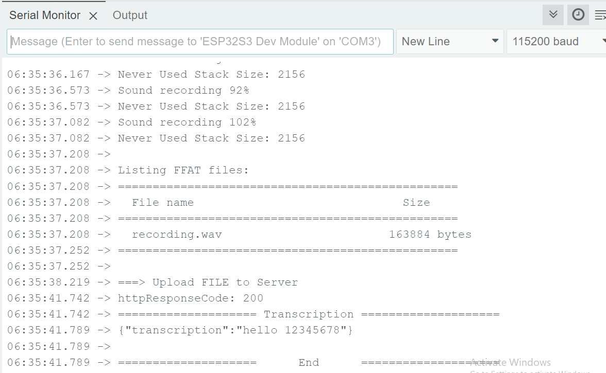
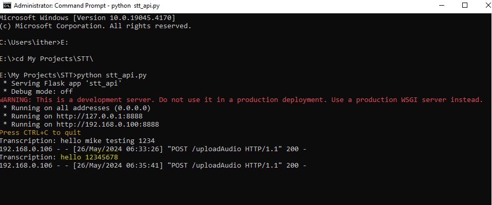
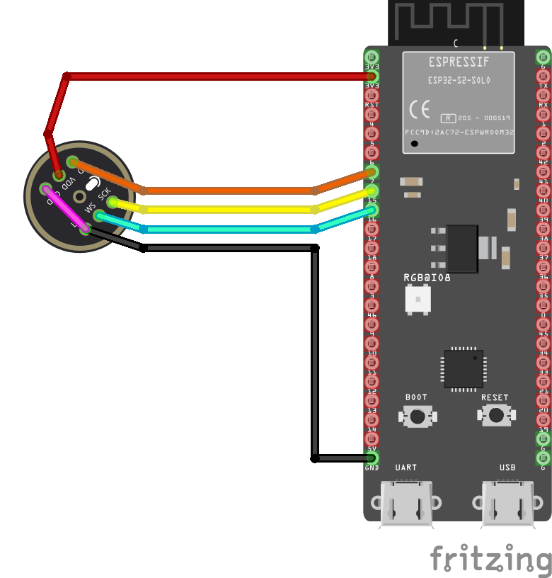

# ESP32 Speech-To-Text (No API Key Required)

Industrial-grade speech-to-text pipeline for ESP32. This repository provides:

* An ESP32 client that captures audio over I2S and posts WAV to a server.
* A lightweight Flask/Gunicorn server that returns JSON transcriptions via `speech_recognition`.

Designed for deterministic embedded behavior, clean I2S lifecycle, and zero vendor lock-in.

---

## Overview

* **Client**: ESP32 (Arduino) captures 16-bit mono audio and uploads to a server.
* **Server**: Flask endpoint processes audio and returns transcription (`/uploadAudio`).
* **Wake Word (optional)**: Integrate the MARVIN wake word for hands-free activation.

### Server Repository

* **ESpeechServer**: [https://github.com/TheZeroHz/ESpeechServer](https://github.com/TheZeroHz/ESpeechServer)
  Deploy locally or to cloud (recommended), e.g. **Render**.

### Wake Word Library (Optional)

* **Marvin\_WakeWord\_inferencing**: [https://github.com/TheZeroHz/Marvin\_WakeWord\_inferencing](https://github.com/TheZeroHz/Marvin_WakeWord_inferencing)

---

## Compatibility

* **ESP32 Arduino Core**: **3.3.1** (recommended/supported)
* **Arduino IDE**: 2.3.x
* **Boards**:

  * ESP32-S3 — **validated**
  * ESP32 DOIT DevKit V1 — under test
* **I2S Microphone**: INMP441 (or compatible)

> If you previously targeted ESP32 core **2.0.14**, upgrade to **3.3.1** for best results.

---

## Features

* Low-latency I2S capture with deterministic init/deinit (prevents double driver install).
* No accounts, credit cards, or external API keys required.
* Simple HTTP interface (`POST /uploadAudio`) returning JSON.
* Easily deployable backend with **Gunicorn**.
* Optional wake word handoff (pause WW → record STT → resume WW).

---

## Demo & Tutorial

* **Video (all ESP32 boards)**:
  [https://www.canva.com/design/DAGkKUr6V58/pw6ovNUVmsN3kMa85Zlr7w/watch?utm\_content=DAGkKUr6V58\&utm\_campaign=designshare\&utm\_medium=link2\&utm\_source=uniquelinks\&utlId=h054e4457dc](https://www.canva.com/design/DAGkKUr6V58/pw6ovNUVmsN3kMa85Zlr7w/watch?utm_content=DAGkKUr6V58&utm_campaign=designshare&utm_medium=link2&utm_source=uniquelinks&utlId=h054e4457dc)

* **Screenshots**
  
  

---

## Requirements

### Server

* **Python**: 3.10 (recommended; set `PYTHON_VERSION=3.10` on Render)
* Packages: `Flask`, `SpeechRecognition`, `pydub`, `gunicorn`

### ESP32

* **ESP32 Arduino Core**: **3.3.1**
* **Arduino IDE**: 2.3.x
* **I2S MIC**: INMP441 (or equivalent)
* Stable Wi-Fi

---

## Server Setup

> Use the **ESpeechServer** repository.

1. Clone:

   ```bash
   git clone https://github.com/TheZeroHz/ESpeechServer.git
   cd ESpeechServer
   ```
2. Install:

   ```bash
   pip install -r requirements.txt
   ```
3. Run (production style):

   ```bash
   gunicorn app:app --bind 0.0.0.0:8888
   ```
4. Endpoint:

   * `POST /uploadAudio` (content: WAV) → `{"transcription": "..."}`

### Deploy on Render (Recommended)

* **Build Command**: `pip install -r requirements.txt`
* **Start Command**: `gunicorn app:app`
* **Environment Variable**: `PYTHON_VERSION=3.10`
* Server listens on `PORT` provided by Render automatically.

---

## ESP32 Client Setup

1. Open **Arduino IDE** (2.3.x).
2. Install **ESP32 Arduino Core 3.3.1** via Boards Manager.
3. Open the `SpeechToText_ESP32` example in this repository.
4. Configure:

   * **Wi-Fi** SSID/PASS
   * **Server URL** (local or Render), e.g.:

     ```cpp
     STT.serverURL("https://<your-espeechserver>/uploadAudio");
     ```
   * **I2S pins** to match your hardware (SCK/BCK, WS, SD).
5. Build & flash.

---

## Usage Flow

1. (Optional) Run wake word detection loop.
2. On trigger:

   * Stop WW loop, **deinit I2S** cleanly.
   * Call `STT.recordAudio()` to capture STT audio.
   * Call `STT.getTranscription()` to receive server JSON → string.
   * Re-init WW loop if required.

> Avoid simultaneous ownership of the I2S port to prevent `i2s_driver_install` errors.

---

## API (Server)

* **POST** `/uploadAudio`
  **Body**: WAV (binary or multipart).
  **Response**:

  ```json
  { "transcription": "Hello, how are you?" }
  ```

**curl example**:

```bash
curl -X POST http://localhost:8888/uploadAudio --data-binary "@yourfile.wav"
```

---

## Hardware Reference

* Example wiring shown for **INMP441** + **ESP32-S3** (see: `SpeechToText/img/HardWareSetUP.png`).
  Ensure your I2S pin mapping in the sketch matches your board.



---

## Troubleshooting

* **`i2s port is in use` / `i2s_driver_install(...): configuration is invalid`**

  * Ensure the wake word task is stopped and `i2s_driver_uninstall()` completed **before** ESpeech initializes I2S.
  * Do not install the I2S driver twice.

* **No transcription returned**

  * Verify server reachability and URL.
  * Confirm WAV parameters (16-bit, mono, 8/16 kHz).
  * Check server logs for decoding/engine errors.

* **Board/core mismatch**

  * Use ESP32 Arduino Core **3.3.1**.

---

## Change Log (Summary)

* Align with **ESP32 Arduino Core 3.3.1**
* Deterministic I2S init/deinit to prevent double-install
* Example updates for wake word ↔ STT handoff
* Cleaned includes and configuration to avoid FS conflicts

---

## License

This repository: MIT (see `LICENSE`).
3rd-party libraries retain their respective licenses.
