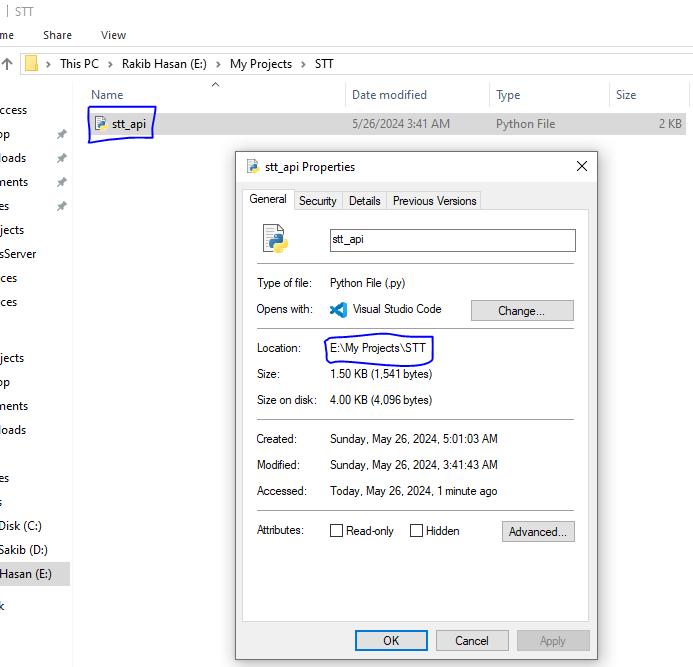
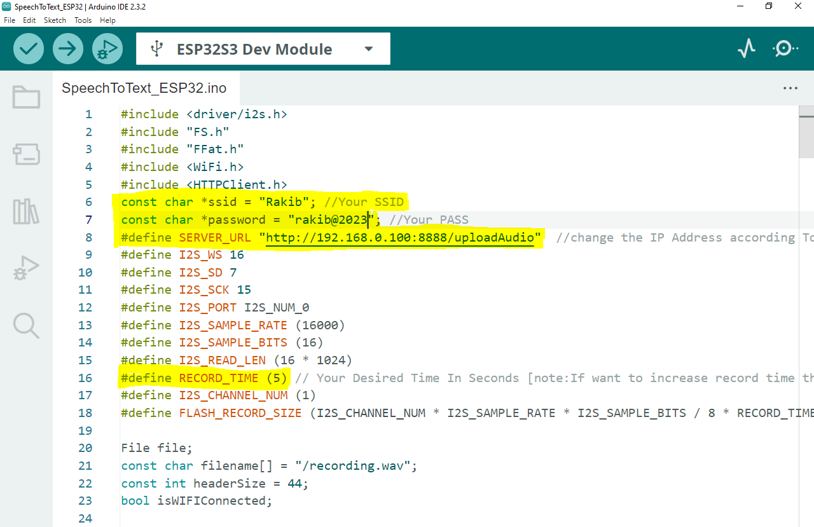

# ESP32 Free Speech To Text without any API Key

This repository contains the code for an audio transcription service using Flask and the `speech_recognition` library. The service accepts audio files, transcribes the speech to text, and returns the transcription as a JSON response.
## Demo


## Supported Boards
- ESP32 S3 (Successfully Tested)
- ESP32 DOIT Devkit V1 (Under Test)

## Features
- Faster and LightWeight
- No need Of any Accounts,Credit Card or API key.
- Upload audio files for transcription.
- Uses `speech_recognition` library for speech-to-text conversion.
- Simple Flask web server to handle file uploads and return transcriptions.

## Before you begin, ensure you have met the following requirements:
### Server Requirements:
- Python 3.7 or later installed.
- `pip` package installer.
- Internet connection for installing dependencies.
### ESP32 Requirements
- ESP Version 2.0.14
- Arduino IDE 2.3.2
- I2S MIC (INMP-441)

## Install server dependencies   
- download and install python if not installed from [here](https://www.python.org/downloads/)
- **open CMD on windows**  [Linux user open terminal & Run Equivalent Commands]
- ```sh
    pip3 install flask
    ```
- ```sh
    pip3 install SpeechRecognition pydub
    ```

## How To Usage?

- Step1: **Download stt_api.py and see the directory of the downloaded file**


- Step2: **Open CMD Then Goto that folder and Run command**

```sh
    python stt_api.py
```


- Step3: **Download 'SpeechToText_ESP32' and open in Arduino IDE. Set Wifi Credentials,IP address of the server and STT timer.**




## HardWare Setup
- **I'm Using INMP441 & ESP32 S3 wroom-1 N16R8.**     [Note: Use your own board and I2S Pins]

