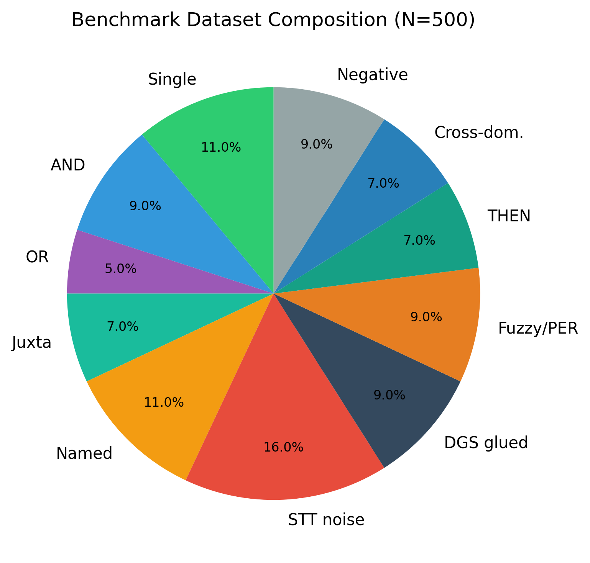
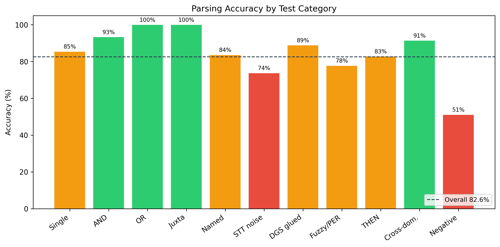
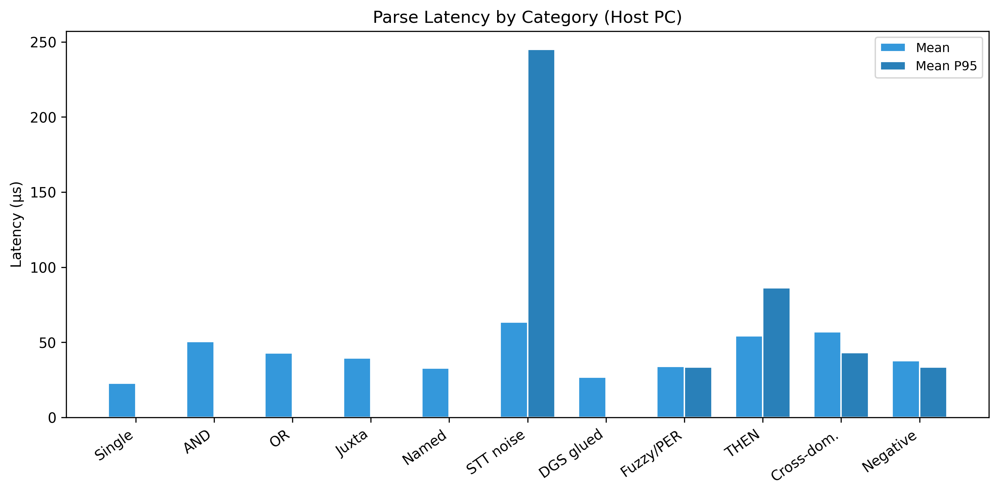
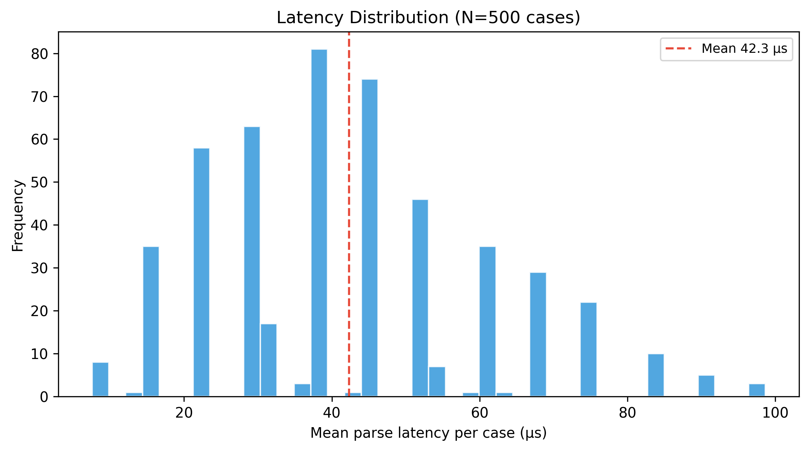
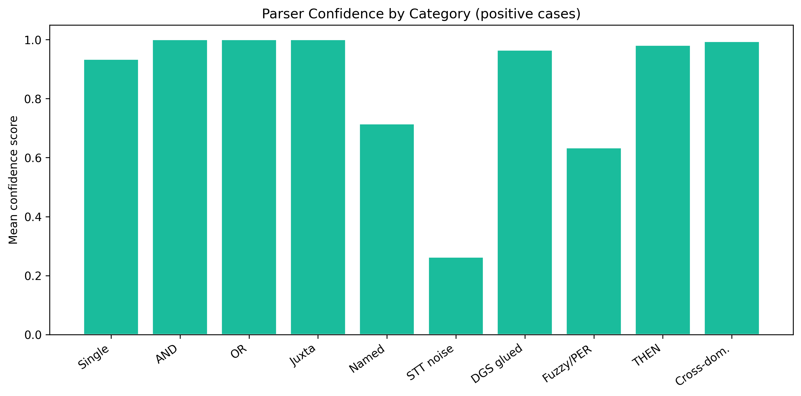
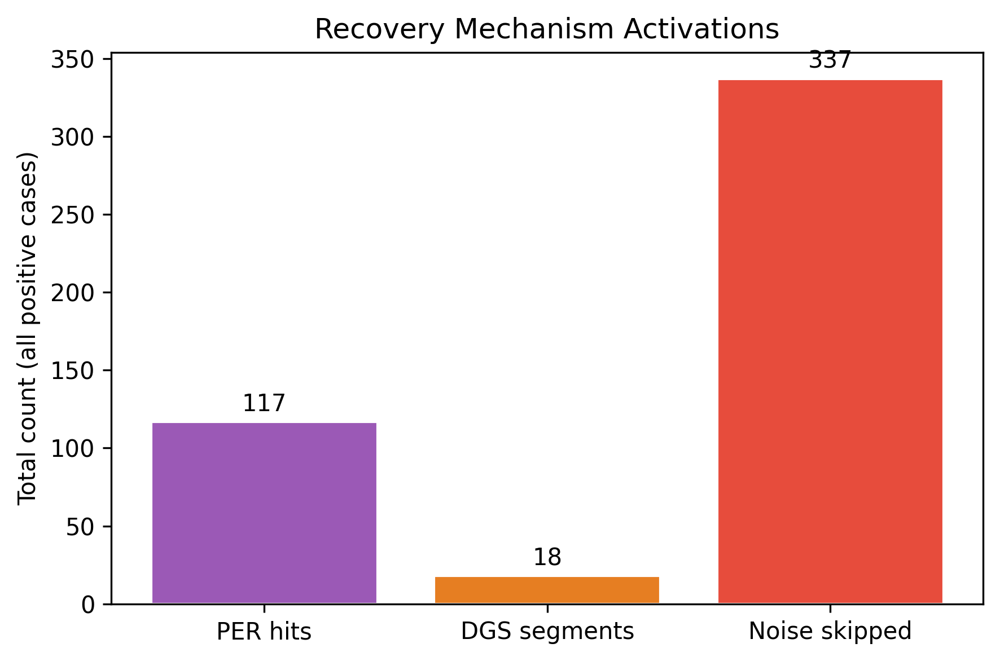
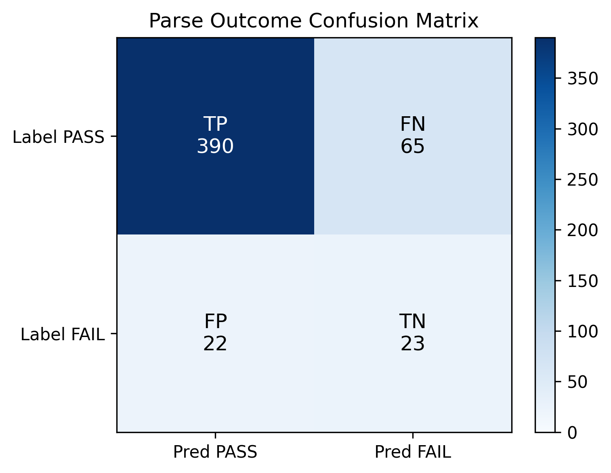
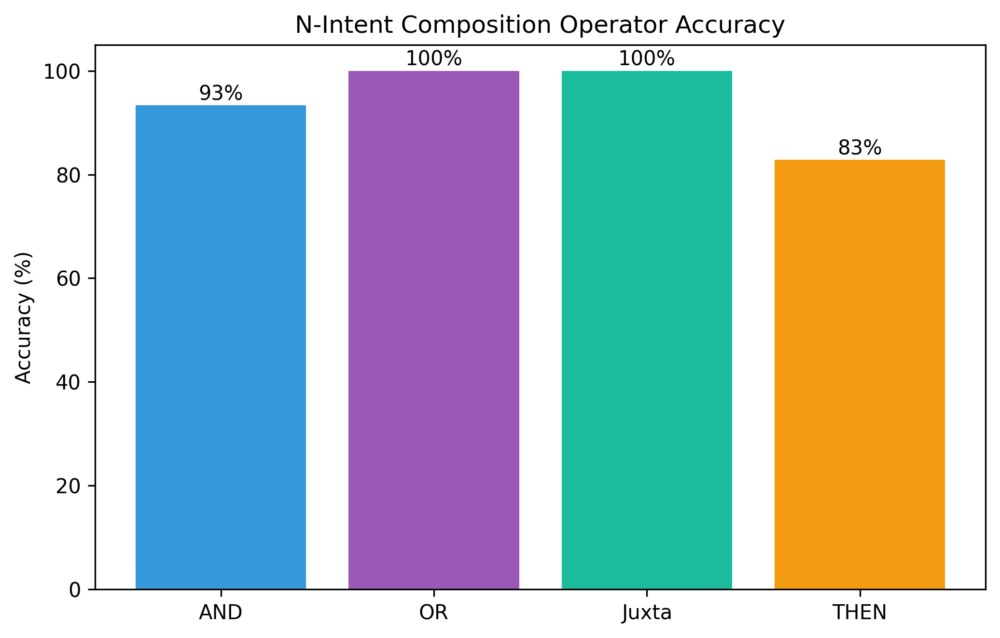

# TinyCFG — Conference Paper Results Package

*Generated: 2026-07-21 14:44*

This document consolidates benchmark results, tables, and figures for publication.
All artifacts are reproducible via `python run_conference_analysis.py`.

---

## 1. Abstract metrics (copy for paper)

| Metric | Value |
|--------|-------|
| Grammar | smart_world v3 patterns=74 |
| Test cases | 500 (11 categories, realistic STT noise) |
| Iterations / case | 200 |
| Platform | host-pc |
| Parser memory | 7684 bytes |
| Overall accuracy | **82.6%** (413/500) |
| Mean parse latency | **42.3 µs** (P95: 46.7 µs) |
| True positives | 388 |
| False negatives | 67 |
| True negatives | 23 |
| False positives | 22 |

**Contributions evaluated:** Pattern-augmented LL(1) parser, DGS deglue, PER/fuzzy recovery, gap-tolerant matching, N-intent composition (AND/OR/back-to-back), CDA.

---

## 2. Experimental setup

- **Dataset:** `dataset/dataset.csv` — 500 labelled utterances with clean commands, multi-intent operators, named slots, STT noise injection, glued words, typos, and negative controls.
- **Harness:** `tinycfg_bench.cpp` — host-side C++ wrapping `TinyCFG::parse()` with high-resolution timing.
- **Recovery:** Fuzzy match ON, PER ON, error recovery ON (default TinyCFG configuration).
- **Metrics:** Label accuracy (pass/fail + expected action), latency (µs), confidence, recovery activations.

---

## 3. Figures



*Figure 1: Dataset composition (500 cases, 11 categories)*



*Figure 2: Parsing accuracy by test category*



*Figure 3: Parse latency by category (mean and P95, µs)*



*Figure 4: Latency distribution across all test cases*



*Figure 5: Parser confidence by category (positive cases)*



*Figure 6: Recovery mechanism activations (PER, DGS, noise skip)*



*Figure 7: Parse outcome confusion matrix*



*Figure 8: N-intent composition operator accuracy (AND, OR, Juxta, THEN)*


---

## 4. Tables

Full statistical tables: **[results/BENCHMARK_ANALYSIS.md](results/BENCHMARK_ANALYSIS.md)**

Includes:
- Table 1: Dataset composition
- Table 2: Accuracy by category
- Table 3: Latency by category (µs)
- Table 4: Robustness metrics (PER, DGS, noise skip)
- Table 5: Misclassified cases
- LaTeX table snippets (if generated with `--latex`)

---

## 5. Raw data

| File | Description |
|------|-------------|
| `dataset/dataset.csv` | Ground-truth labelled dataset |
| `results/results_raw.csv` | Per-case benchmark measurements |
| `results/figures/*.png` | Publication figures (300 DPI) |

---

## 6. Suggested paper text (Results section)

> We evaluated TinyCFG on a dataset of 500 voice commands spanning 11 categories
> including single-intent control, multi-intent composition (AND, OR, implicit
> back-to-back), named device slots, STT noise, glued-word segmentation, and
> phonetic/fuzzy recovery. On a host PC, the parser achieved **82.6% overall
> accuracy** with mean latency **42.3 µs** per parse (P95: 46.7 µs) and a fixed
> memory footprint of **7684 bytes**. Multi-intent composition operators AND,
> OR, and back-to-back juxtaposition reached **93.3%**, **100%**, and **100%**
> accuracy respectively (Figure 8). Recovery mechanisms (PER, DGS, gap-tolerant
> noise skip) activated primarily on noisy and glued inputs (Figure 6), with
> STT-noise category accuracy at **73.8%**.

---

## 7. Reproduce

```bash
cd benchmark
python run_conference_analysis.py --iterations 200
```

Or on Windows after MinGW install:
```bat
build.bat
python run_conference_analysis.py
```

---

*TinyCFG benchmark package — ESpeech library*
